# Sensor Pattern Noise Extraction with Wiener Filtering — Dresden Image Database

[](https://www.mathworks.com/)
[](http://forensics.inf.tu-dresden.de/ddimgdb/)
[]()
[]()
[](LICENSE)

Source-device identification using Sensor Pattern Noise (SPN). The pipeline extracts the noise residual from each image with a Wiener filter, builds a per-device reference noise pattern (centroid) from training images, and classifies a query image by Normalised Cross-Correlation (NCC) against every centroid. Three channel variants are compared on a 10-device subset of the Dresden Image Database — full RGB color, gray (mean over RGB), and green only — and a PCE matching script is included as a method extension.

---

## Table of Contents

- [Background](#background)
- [Pipeline](#pipeline)
- [Dataset](#dataset)
- [Method](#method)
- [Results](#results)
- [Repository Structure](#repository-structure)
- [Usage](#usage)
- [References](#references)

---

## Background

Every camera sensor leaves a faint, deterministic, multiplicative noise pattern on the images it captures, caused by manufacturing variations between individual photo-sites. This pattern — Photo-Response Non-Uniformity (PRNU), the dominant component of Sensor Pattern Noise — is unique to each sensor and survives JPEG compression and ordinary image processing, which makes it a reliable fingerprint for source-device identification.

The standard recipe, going back to Lukáš, Fridrich and Goljan (2006), is:

1. denoise the image with a filter `F`,
2. take the residual `r = I − F(I)` as a noisy realisation of the sensor pattern,
3. average residuals over many images of one device to suppress scene content and recover the underlying pattern,
4. match a query residual against each device's reference pattern by correlation.

This repo implements that recipe with MATLAB's `wiener2` denoiser, NCC matching, three channel variants (color / gray / green), and a PCE matching extension.

## Pipeline

```mermaid
flowchart LR
    A[Dresden image] --> B[Wiener denoise]
    B --> C[Residual<br/>r = I - F&#40;I&#41;]
    C --> D{Channel}
    D -->|full RGB| E[Color residual]
    D -->|mean RGB| F[Gray residual]
    D -->|G only| G[Green residual]
    E --> H[Per-device centroid<br/>μ&#95;c]
    F --> H
    G --> H
    H --> I[Zero-mean +<br/>L2 normalise]
    I --> J{Matching}
    J -->|inner product| K[NCC score]
    J -->|FFT cross-corr| L[PCE score]
    K --> M[Predicted device]
    L --> M
```



## Dataset

Experiments use a 10-device subset of the **Dresden Image Database** for camera forensics. The full dataset contains 14k+ images from 73 cameras across 25 models; this repo uses 10 anonymised devices labelled `Device 01` through `Device 10`.

Each image is processed into a 256 × 256 residual patch (taken from a fixed location per image), giving:

| Split  | Patches per device | Total |
|--------|-------------------:|------:|
| Train  | varies (~50–100)   | —     |
| Test   | 31 – 81            | 465   |

Test patches per device, derived from the confusion matrix:

| Device | 01 | 02 | 03 | 04 | 05 | 06 | 07 | 08 | 09 | 10 |
|--------|---:|---:|---:|---:|---:|---:|---:|---:|---:|---:|
| Patches | 41 | 43 | 34 | 72 | 81 | 36 | 31 | 33 | 45 | 49 |

The dataset is **not** redistributed in this repo. Download it from the official source linked in [References](#references).

## Method

### Residual extraction
For an image `I`, MATLAB's `wiener2` adaptive filter estimates the local mean and variance and produces a denoised image `F(I)`. The residual

```
r = I − F(I)
```

is taken as the noise component. This is computed once per image and stored as a 256 × 256 patch.

### Channel selection
Three variants are compared:

- **Color** — the full `H × W × 3` RGB residual is kept; zero-mean and L2 normalisation are taken jointly across all three channels, so the centroid `μ_c` is also a 3D tensor and NCC sums over all three channels.
- **Gray** — `r_gray = mean(r, channels)`. Cheap and scene-neutral, but folds three channels into one and loses information.
- **Green** — `r_green = r(:, :, 2)`. Most CFA patterns sample green twice as often as red or blue, so the green channel is often quoted in the literature as carrying the strongest, lowest-aliased PRNU signal.

### Matching: NCC vs PCE
The default classifier is **NCC** (Normalised Cross-Correlation) — the inner product of two zero-mean unit-norm residuals. As a method extension, `extract_wiener_pce.m` implements the **PCE** (Peak-to-Correlation Energy) score from Goljan et al. (2009), which computes the full 2D cross-correlation surface via FFT, takes the squared peak, and divides by the energy of the surface outside a small exclusion window around the peak. PCE is the standard SPN matching metric in the forensics literature because it is sharpness-aware and robust to small spatial misalignments — useful when query and reference are not pixel-aligned.

### Centroid construction
For each device `c`, all training residuals `r_k^(c)` are zero-mean shifted, summed, averaged, then zero-meaned and L2-normalised:

```
μ_c = (1/N) Σ_k r_k^(c)
μ_c ← μ_c − mean(μ_c)
μ_c ← μ_c / ‖μ_c‖₂
```

This is one centroid per device — the reference fingerprint. A query residual `z` is processed identically and scored against every centroid by `⟨z, μ_c⟩`, with `argmax` giving the prediction.

## Results

### Headline accuracy

All three variants use the same training/test split and the same NCC matching. The only thing that changes is which channel data feeds the centroid.

| Variant | Channel data | Accuracy | # Classes | # Test patches |
|---|---|---:|---:|---:|
| **Color** | Full RGB residual (H × W × 3) | **73.76 %** | 10 | 465 |
| **Gray**  | Mean across RGB | 71.40 % | 10 | 465 |
| **Green** | G channel only | 70.97 % | 10 | 465 |

Full RGB wins by a margin of **~2.4 points over gray** and **~2.8 over green-only**. This runs against the common assumption that green-only is best because most CFA patterns sample green twice. Two plausible reasons:

1. The Bayer-pattern argument is true at the *raw* level — once images are demosaiced and saved as JPEG, useful PRNU information is also smeared into the red and blue channels, and discarding them throws signal away.
2. The full-RGB centroid has 3× the dimensionality, so the coincidence baseline for a wrong match is lower; the additional channels act as a soft regulariser even where their PRNU signal is weak.

### Gray channel — per-class breakdown

Computed from the gray confusion matrix below. Recall = TP / total true; precision = TP / total predicted.

| Device | TP | Total true | Recall | Total pred. | Precision |
|--------|---:|-----------:|-------:|------------:|----------:|
| 01 | 24 | 41  | 58.5 % | 29  | 82.8 % |
| 02 | 38 | 43  | 88.4 % | 39  | 97.4 % |
| 03 | 25 | 34  | 73.5 % | 25  | 100.0 % |
| 04 | 56 | 72  | 77.8 % | 56  | 100.0 % |
| 05 | 67 | 81  | 82.7 % | 157 | 42.7 % |
| 06 |  3 | 36  |  8.3 % | 3   | 100.0 % |
| 07 | 18 | 31  | 58.1 % | 18  | 100.0 % |
| 08 | 21 | 33  | 63.6 % | 22  | 95.5 % |
| 09 | 42 | 45  | 93.3 % | 78  | 53.8 % |
| 10 | 38 | 49  | 77.6 % | 38  | 100.0 % |

### Gray confusion matrix

<p align="center">
  
</p>


### Observations

- **Device 06 collapses** — only 3 of 36 test patches are correctly identified and 20 are misclassified as Device 05. The two cameras likely share a sensor model, leaving residual fingerprints that are too similar for a single-channel Wiener residual to disambiguate.
- **Device 05 acts as an attractor** — it absorbs misclassifications from Devices 01, 04, 06, 07, 08, and 10. Its centroid sits closer to the global mean of all residuals than the others, so weak query residuals (low-SNR scenes, smooth content) drift toward it. A whitening step or a confidence threshold would help.
- **Devices 02, 03, 09, 10** are clean — high precision and recall, confirming the method works as expected when the underlying fingerprints are distinct.
- **Channel choice helps in aggregate but does not fix the hard pairs** — full-RGB beats gray and green-only, but the (05, 06) confusion is structural and would need a different fix (PCE, whitening, or a learned representation).

### Limitations

- The 10-device subset is small; results may not extrapolate to the full 73-camera Dresden set.
- Wiener-only residuals retain JPEG/scene structure that contaminates the centroid; production PRNU pipelines typically chain a wavelet denoiser, Wiener filter, and zero-mean / row-column subtraction (Chen et al. 2008) for cleaner residuals.
- NCC scores are unitless and have no false-acceptance threshold; PCE (provided as a method extension) would give per-prediction confidence at the cost of more compute.

## Repository Structure

```
spn-wiener-dresden/
├── src/
│   ├── extract_wiener_color.m     # Full RGB pipeline (best result)
│   ├── extract_wiener_gray.m      # Mean-RGB pipeline
│   ├── extract_wiener_green.m     # Green-channel pipeline
│   └── extract_wiener_pce.m       # PCE matching, reuses gray centroids
├── results/
│   ├── Wiener_Centroids_Gray.mat  # Trained gray centroids (10 × 256 × 256)
│   └── Wiener_Centroids_Green.mat # Trained green centroids
├── assets/
│   └── confusion_matrix_gray.jpg
├── .gitignore
├── LICENSE
└── README.md
```

## Usage

### Requirements
- MATLAB R2022a or newer
- Image Processing Toolbox (for `wiener2`, `confusionchart`, `fileDatastore`)

### Data layout
All four scripts expect the dataset arranged as:

```
data/
├── train/
│   ├── Device_01/
│   │   ├── patch_0001.mat   % each .mat contains a variable named `residual`
│   │   └── ...
│   ├── Device_02/
│   └── ...
└── test/
    ├── Device_01/
    └── ...
```

Each `.mat` file holds one variable, `residual`, of size `H × W × 3` (the unprocessed RGB Wiener residual). The color script keeps all three channels; the gray and green scripts collapse to a single channel internally.

### Run

```matlab
% from the repo root
cd src
extract_wiener_color    % full RGB residual — best result here
extract_wiener_gray     % mean-over-RGB residual
extract_wiener_green    % green channel only
extract_wiener_pce      % PCE matching, requires gray centroids to exist
```

Each script trains, saves centroids to `results/`, prints accuracy, and plots the confusion matrix. `extract_wiener_pce.m` is a matching-only script and reuses the centroids saved by `extract_wiener_gray.m`, so run gray first.

## References

- J. Lukáš, J. Fridrich, M. Goljan. *Digital camera identification from sensor pattern noise.* IEEE TIFS, 2006.
- M. Chen, J. Fridrich, M. Goljan, J. Lukáš. *Determining image origin and integrity using sensor noise.* IEEE TIFS, 2008.
- M. Goljan, J. Fridrich, T. Filler. *Large scale test of sensor fingerprint camera identification.* SPIE Media Forensics and Security, 2009.
- T. Gloe, R. Böhme. *The Dresden Image Database for benchmarking digital image forensics.* ACM SAC, 2010.

Dataset: <http://forensics.inf.tu-dresden.de/ddimgdb/>

## License

MIT — see [LICENSE](LICENSE).
